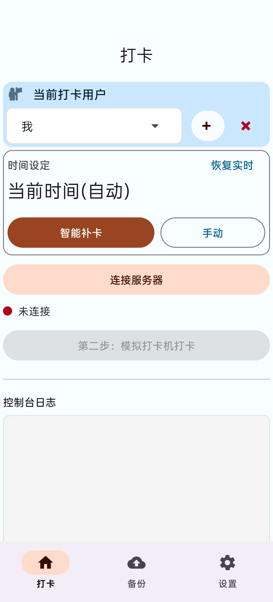

# 📱 得力打卡助手 (Delicheck)

  

**得力打卡助手** 是一款基于 Android 的智能物联网设备模拟工具。它通过 MQTT 协议模拟考勤机的打卡行为，支持多用户管理、多设备 ID 隔离、智能随机时间生成以及配置的备份与还原。

旨在提供一个优雅、高效且人性化的补卡辅助体验。

---

## ✨ 核心功能

* **📡 MQTT 通信**：基于 TCP 连接 MQTT 服务器，模拟真实设备上报数据。
* **👥 多用户 & 多设备隔离**：
    * 支持添加/删除打卡用户。
    * **设备 ID 隔离**：切换设备 ID 时，会自动加载该设备专属的用户列表，防止数据混淆。
* **🎲 智能时间推荐**：
    * 根据预设的早/晚区间，自动生成随机打卡时间（精确到秒）。
    * 自动识别夏令时（5月-9月）与冬令时，适配不同的下午打卡规则。
* **🕒 极简时间选择器**：
    * **两步走设计**：先选日期，再选时间。
    * **防误触限制**：时间选择强制限制为 `07/08` (早) 和 `14/15` (晚) 四个钟点，杜绝选错时间。
* **💾 数据备份**：支持将所有配置（含多设备用户数据）导出为 JSON 代码，或从剪贴板一键导入。
* **🎨 Material Design 3 界面**：
    * 底部导航栏 (Bottom Navigation) + 左右滑动切换。
    * 优雅的悬浮提示 (Floating Toast) 动画。
    * 动态连接状态反馈（黄灯等待、红灯断开、绿灯连接）。

---

## 📸 应用截图

| 🏠 核心主页 |
 
---

## 🛠️ 技术栈

* **语言**: Kotlin
* **架构**: MVP (Model-View-Presenter)
* **UI 组件**:
    * ViewPager2 + BottomNavigationView
    * Material Components (Cards, Chips, Buttons, TextFields)
    * ConstraintLayout & NestedScrollView
* **通信**: Eclipse Paho MQTT Client
* **存储**: SharedPreferences + Gson (JSON 序列化)
* **混淆优化**: R8 / ProGuard (Release 包体积优化至 ~2MB)

---

## 📦 快速开始

1. 克隆项目到本地。
2. 使用 Android Studio 或 AndroidIDE 打开。
3. 同步 Gradle 依赖。
4. 连接真机或模拟器运行。
5. 配置打卡参数
